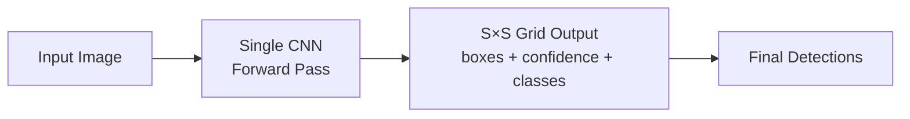

# yolo-object-detection-pipeline
This project implements an end-to-end YOLOv8 object detection pipeline. It demonstrates the complete workflow of loading a pretrained model, training it on a sample dataset, saving optimized weights, and performing inference on both images and real-time webcam input.

The pipeline uses transfer learning by initializing the model with pretrained weights and refining them through training on a small dataset. During training, the model learns to predict bounding boxes, objectness scores, and class probabilities by minimizing a composite loss function. The best-performing model weights are saved and later used for inference.

After training, the model is applied to detect objects in images, producing bounding boxes with confidence scores. The same inference process is extended to real-time webcam input, enabling continuous object detection.

The project also generates a structured output directory containing training logs, performance metrics, model checkpoints, and prediction results, providing a complete view of the model lifecycle from training to deployment.

# How YOLO Sees the World in One Glance

Before YOLO, object detectors worked like a paranoid security guard with a flashlight — scanning thousands of cropped windows across an image, each time asking *“is there something here? what about here? here?”* Models like R-CNN literally ran a classifier thousands of times per image. Accurate, but painfully slow. YOLO’s insight was almost embarrassingly simple: **what if we just looked at the whole image once and predicted everything in a single shot?** That’s the entire name — *You Only Look Once*.

Here’s the trick that makes it click. YOLO chops the image into an `S × S` grid (say 13×13). Each grid cell is responsible for any object whose **center** falls inside it — and only that cell. For its assigned object, the cell directly spits out a handful of numbers: bounding box `(x, y, w, h)`, a confidence score (how sure it is something’s there), and class probabilities (dog? car? person?). One forward pass through a CNN, one big tensor out, done. The whole problem collapses into a single regression — no region proposals, no separate classification stage, no rerun loops. Because the network sees the **entire image** in that one pass, it also picks up global context (a bicycle near a road is more likely a bike than a weird sculpture).

That single-pass design is why YOLO runs in real time (30–150+ FPS depending on the variant) and why it became the workhorse for self-driving prototypes, drone vision, wildlife cameras, and basically every edge-deployment detection task. Modern versions (YOLOv8 → v11) keep the same core idea but layer on anchor-free heads, stronger backbones (CSPDarknet, EfficientRep), and smarter losses (CIoU, DFL). Once the *“look once, regress everything”* framing clicks, the rest of the family is just engineering on top — and fine-tuning one on a new dataset is mostly swapping the head’s class count, pointing it at your labels, and letting the pretrained backbone do the heavy lifting.
